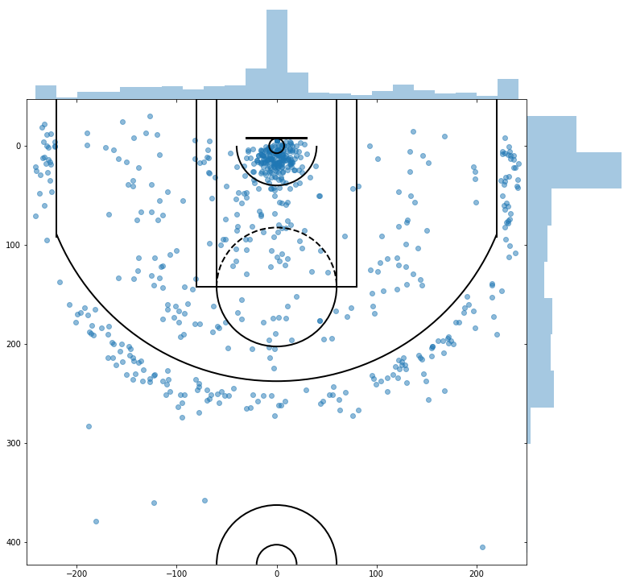

```{r setup, include=FALSE}
knitr::opts_chunk$set(echo = TRUE)
set.seed(1234)
```

## Project Description
Basketball is a team sport that is played by millions of people around the world. In a regulation game, there are two teams of 5 players each, and their goal is to be able to shoot a basketball into a hoop that is elevated off of the ground. The professional league in the United States is called the National Basketball Association (NBA). One of the most popular and winningest teams is the Los Angeles Lakers. For this final project, the spatial locations for each shot that was attempted by a Los Angeles Laker during the first 7 regular season games of the 2019-2020 NBA season was collected.

A representation of this with an outline of the court is below.
<br><br>

## Data Scraping Process
The NBA stores many advanced metrics and detailed data that is collected during games on their site at <a>stats.nba.com</a>. Additionally, there are multiple resources on <a href=https://github.com/slieb74/NBA-Shot-Analysis/blob/master/nba_shots_scraper.py>Github</a>, which allow one to pull the information programmatically. An existing script that pulls information from the NBA API in order to pull the information was modified and used for this project. Unfortunately, after running the script a couple of times, access to the API became limited/blocked and I wasn't able to pull more data.

```{r import, message=FALSE, warning=FALSE, include=FALSE}
## Libraries and Data Import
# set working directory
setwd("/Users/andrewsang/Dropbox/ucla/2019_09Fall/STATS416/Final Project/")
library(splancs)
library(dplyr)
library(spatstat)
library(spatial)
library(fields)

# import data
df = read.csv("data/shot_data_clean.csv")
print(df %>% dim())

# look at first few rows
df %>% head()
```

## Data Description
The dataset represents shot attempts for 7 games, which resulted in a total of 625 shot attempts. Each shot attempt has many pieces of information, but the piece that was most interesting was the loc_x and loc_y fields. The locations of the shot attempts was normalized into a 1x1 window. 

Each point here represents a shot attempt. In a real game, there are 2 baskets, and each team shoots at one basket only. Throughout the course of a game, the teams will rotate which basket they are shooting towards every quarter. For this dataset, only 1 basket is represented, and it's the basket that the team is shooting towards.

A plot of the points with their normalized locations are below.

```{r fig1, fig.width=4, fig.asp=1, results='hide', fig.keep='all', echo=FALSE}
x1 = df$norm_x
y1 = df$norm_y
n  = length(x1)

plot(c(0,1),c(0,1), type="n", xlab="x-coordinate",ylab="y-coordinate", main="Lakers Shot Chart") +
  points(x1,y1, col=rgb(red=0, green=0, blue=0, alpha=0.5))
```

## Kernel Smoothing
Kernel smoothing for point processes is a method that allows the end-user to simplify the plot of the point process. A good way of describing the technique laid out by Professor Schoenberg is that it's similar to "smashing peas". An important parameter for kernel smoothing is the bandwidth, which controls the amount of smoothing that is applied.

```{r fig2, fig.width=11, fig.asp=.45, echo=FALSE, results=FALSE}
par(mfrow=c(1,2))
bdw = sqrt(bw.nrd0(x1)^2+bw.nrd0(y1)^2)  # .05 
b1 = as.points(x1,y1)
bdry = matrix(c(0,0,1,0,1,1,0,1,0,0),ncol=2,byrow=T)
z = kernel2d(b1,bdry,bdw)
image.plot(z,col=gray((64:20)/64),xlab="x",ylab="y", main="Lakers Shot Chart, Bandwidth:.05")
  # + points(b1, col=rgb(red=0, green=0, blue=0, alpha=0.2))

bdw = .025 # override and choose own bandwidth
z = kernel2d(b1,bdry,bdw)
image.plot(z,col=gray((64:20)/64),xlab="x",ylab="y", main="Lakers Shot Chart, Bandwidth:.025")
```

The two plots above have varying bandwidths. A smaller bandwidth means that we are smoothing by less. Looking at the two plots, the second one does a sligthly better job in representing the point process.The main reason is that the figure on the left has a moderate amount of grey in the two pixels above the basket, which is statistically accurate but not functionally accurate. In a game of basketball, we wouldn't expect many shots to come from above the basket. Additionally, the plot on the right does a slightly better job in showing the gap of points right inside of the 3 point line. As expected, there is a great deal of grey (representing a large lambda or intensity of points) close to the basket. 

Looking at the data and the kernel smoothing plots, it does seem like this is an inhomogenous poisson process (as there does seem to be very different intensities of points in the total space). This seems to manifest itself in many points close to the basket, as previously mentioned. In addition to this, there are very few shots far from the basket. This can be observed when looking at the lack of intensity below y=0.4. This effect makes sense in terms of basketball, as you generally have better accuracy, the closer you are to the basket. All else equal, a shot closer to the basket has a higher chance of scoring.

## L and J functions
In addition to the kernel smoothing plots, we can also look at functions like the K and L functions, which can tell us about the amount of clustering or inhibition for a given radius.
```{r fig4, fig.width=11, fig.asp=.45, results='hide', fig.keep='all', echo=FALSE}
# Run Simulations
s = seq(.001,.3,length=50)
k4 = khat(b1,bdry,s)
k4conf = Kenv.csr(npts(b1), bdry, 1000, s, quiet=TRUE)

# K-function
# plot(c(0,max(s)),c(0,max(k4conf$upper,k4)), type="n",xlab="distance",ylab="K4(h)", main="K-function with Confidence bounds") +
#   points(s,k4,pch="*") +
#   lines(s,k4) +
#   lines(s,k4conf$upper,lty=3,col="green",lwd=2) +
#   lines(s,k4conf$lower,lty=3,col="green",lwd=2) 

# L-function
L4 = sqrt(k4/pi)-s
L4upper = sqrt(k4conf$upper/pi) - s  
L4lower = sqrt(k4conf$lower/pi) - s 
L4upper_theory = 1.96 * sqrt(2*pi*1*1) * s / n 
L4lower_theory = -1.0 * L4upper 

par(mfrow=c(1,2))
plot(c(0,max(s)),c(min(L4lower,L4),max(L4upper,L4)), 
     type="n",xlab="distance",ylab="L4(h) - h", main="L-function with Confidence bounds") +
  points(s,L4,pch="*") +
  lines(s,L4) +
  lines(s,L4upper,lty=2,col="green",lwd=2) +
  lines(s,L4lower,lty=2,col="green",lwd=2) +
  lines(s,rep(0,length(s))) + 
  lines(s,L4upper_theory,lty=3,col="orange",lwd=2) +
  lines(s,L4lower_theory,lty=3,col="orange",lwd=2) 

### THEORETICAL BOUNDS for L-function 
## bounds = 1.96 * sqrt(2*pi*A) * h / E(N), where 
## A = area of space, and 
## E(N) = expected # of pts in the space (approximated here using 
## the observed # of pts

## J(r) = (1-G(r))/(1-F(r)).
## J = 1 corresponds to a stationary Poisson process. 
## J < 1 indicates clustering. J > 1 indicates inhibition
b2 = as.ppp(b1, W = c(0,1,0,1))
j4 = Jest(b2) 
plot(j4, main="J-function")
# ## or to control the plot yourself, try: 
# plot(j4$r[j4$r<.3],j4$rs[j4$r<.3],xlab="h",ylab="J(h)",type="l",lty=1) 
# lines(j4$r[j4$r<.3],j4$theo[j4$r<.3],lty=2) 
# legend(.2,.2,lty=c(1,2),legend=c("data","Poisson"))
```
Looking at both plots, it seems like there is clustering present in both. In the L-function plot on the left-hand side, the value is much greater than 0 and higher than the simulated and theoretical bands. The bands as well as 0 represent no clustering or inhibition. Because the plot is so much greater than both, it seems like there is definite clustering present. Additionally, the J-function shows something similar where the plot is much below 1, which indicates that there may be clustering present. 

```{r plotter_function, echo=FALSE}
generate_lambda_for_spaces = function(fit_model, len=25, title="lambda", ...){
  # Create matrix of placeholder spaces where we will compute lambda
  x2 = seq(0.05,0.95,length=len)
  y2 = seq(0.05,0.95,length=len)
  zz2 = matrix(rep(0,(len*len)),ncol=len)

  # loop through and predict for each value of 
  for(i in 1:len){
    for(j in 1:len){
      zz2[i,j] = predict(fit_model, locations=data.frame(x=x2[i], y=y2[j]))
    }
  }
  
  # output plot
  image.plot(x2,y2,zz2,xlab="x-coordinate", ylab="y-coordinate", main=title, col=gray((64:20)/64)) + 
    points(x1,y1)
  
  # return matrix of lambdas 
  return(zz2)
}

```

## First Model
For modeling, the point process was modeled as an inhomogeneous Poisson model. The ppm function from the spatstat library was utilitzed. The first model had the form $\lambda_{\theta}(x,y) = e^{\theta_{0} + \theta_{1}x + \theta_{2}y}$.

```{r Poisson Model, fig.width=11, fig.asp=.45, echo=FALSE}
# https://www-ljk.imag.fr/membres/Jean-Francois.Coeurjolly/documents/lecture2.pdf
W = owin(c(0,1),c(0,1))

# Here, the model that we are fitting is lambda(theta) of x,y = exp (theta_0 + theta_1 x + theta_2 y)
pp1 = as.ppp(df %>% mutate(x = norm_x, y = norm_y) %>% select(x, y), W)
fit1 = ppm(pp1, ~x + y)
fit1
# predict(fit1, locations=data.frame(x=seq(0.05,0.95,length=10), y=seq(0.05,0.95,length=10)))
# plot(simulate(fit1))
# generate_lambda_for_spaces(fit1, title="lambda for model 1")

# logLik(fit1)
# integral(residuals(fit1, type="pearson"))

par(mfrow=c(1,2))
plot(predict(fit1))
plot.msr(residuals(fit1, type="pearson"), equal.markscale = TRUE)
```
The coefficients on the model indicate that there is little movement in lambda when moving to the left or right, by looking at the relatively small coefficient on the x feature. Additionally, the relatively large coefficient on the y feature, tells us that lambda is greater for larger values of y. The trend and residual plots above show lambda as well as the Pearson residuals for the model. We can assume that the large concentration of shots near the basket largely influenced the model's fit. This simple 2 parameter (3 including the intercept) has an issue with the points around the three point arch towards the middle of the plot, as the model predicts a low lambda but sees more points than expected.

## Second Model
The second model that was fitted was a more complex inhomogeneous Poisson model. The model had the form $\lambda_{\theta}(x,y) = e^{\theta_{0} + \theta_{1}x + \theta_{2}y + \theta_{3}xy + \theta_{4}x^{2} + \theta_{5}y^{2}}$.
```{r Second Poisson Model, fig.width=11, fig.asp=.45, echo=FALSE}
fit2 = ppm(pp1, ~polynom(x,y,2))
fit2 # view coefficients

par(mfrow=c(1,2))
# plot(simulate(fit2))
# generate_lambda_for_spaces(fit2, title="lambda for model 1")
plot(predict(fit2))
plot.msr(residuals(fit2, type="pearson"), equal.markscale = TRUE)
```
The second model has many more coefficients. The plot here seems to do a much better job in predicting the points around the basket, as well as displays decreasing likelihood as the distance increases from the basket.

```{r residuals, echo=FALSE}

# residuals(fit1, type="pearson")$discrete %>% abs() %>% sum()
# diagnose.ppm(fit1, type="pearson")

# residuals(fit2, type="pearson")$discrete %>% abs() %>% sum()
# diagnose.ppm(fit2, type="pearson")

results = do.call(rbind, 
                  Map(data.frame, 
                      pearson=c(integral(residuals(fit1,type="pearson")), integral(residuals(fit2,type="pearson"))),
                      logLik=c(logLik(fit1), logLik(fit2)), 
                      deviance=c(deviance(fit1), deviance(fit2)),
                      AIC=c(AIC(fit1),AIC(fit2))))
row.names(results) = c('model1','model2')
results
```
The second model seems to fit much better based on the model metrics like Pearson Residuals (closer to 0), logLikelihood (higher), deviance (lower), and AIC (lower). 

## Comments on Inhomogeneity vs. Causal Clustering
For this dataset, it seems that the aggregation of points in the data is due to inhomogeneity (instead of causal clustering). The conclusion was drawn due to the fact that if we had a different 7 games of data from the same team and observed the data, I think that we'd see a very similar distribution of points. I would expect to see many points near the basket and then fewer shot attempts as the distance increases to the basket. Additionally, I would expect to see a lack of points directly inside of the three point line. Thus, it's more of a function of the space compared to something about the point that truly causes another point to occur.

That being said, the introduction of sports analytics in basketball has shown that when factoring at the expected value of a shot attempt = (point value: 2 or 3) x accuracy (shot taken / shot attempts), it is optimal to maximize the number of layups, dunks, and threes while minimizing the number of jump shot attempts taken inside of the three point line. This has caused a shift in the distribution of shot attempts over the last few decades of the nba (source: https://shottracker.com/articles/the-3-point-revolution). This might indicate that there is some causal clustering in the sense that we might expect to see that successful or winning teams' shot distributions may have some effect on other teams over time.

## Next Steps
I was not able to explore it further, but it would be interesting if we had more data around each point to be able to layer in the expected value of a shot attempt. Would historical information about the accuracy at a particular location multiplied by whether it was a 3 point or 2 point attempt lead to a better fitting model? 

It would also be interesting to research different (non-Poisson models) that could take into account the three point line to better predict the regions right inside and outside of the three point line.